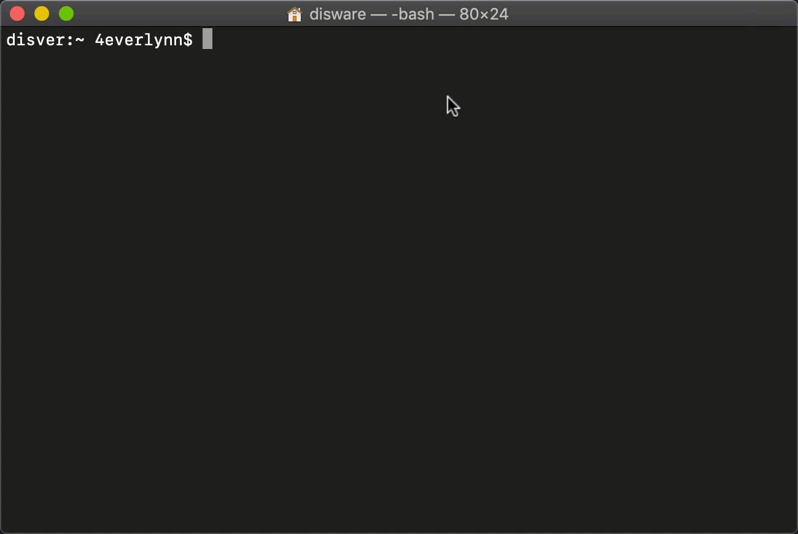

# Git Reporter generator

[](https://www.travis-ci.org/4everlynn/gitlog-reporter)




## Commit format

format
```
module://message
```

example:

```bash
实时因子页面://修复加载速度
实时因子页面://修复数据不正确问题
实时因子页面://新增根据因子组查询功能
历史因子页面://修复加载速度
修复加载速度
```

对于以上数据，实际生成格式应该为:

```text
1、修复加载速度
2、历史因子页面
    a、修复加载速度
3、实时因子页面
    a、修复加载速度
    b、修复数据不正确问题
    c、新增根据因子组查询功能
```

# 使用步骤
```text
1、打开项目目录下的reporter.sh

2、修改变量deal_path值，改为项目在机器上下载的位置

3、进入到项目根路径

4、执行 ./reporter.sh -repo git仓库1绝对路径,git仓库2绝对路径, ... ,git仓库n绝对路径

5、根据提示生成日报/周报
```

# 技巧
将`-repo`的参数值设置到环境变量中(`/etc/profile` | `~/.bash_profile`)
就可以实现如演示GIF的效果